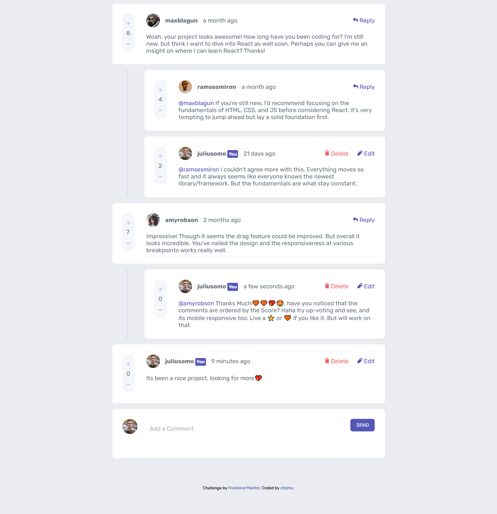

# Frontend Mentor - Interactive comments section solution

This is a solution to the [Interactive comments section challenge on Frontend Mentor](https://www.frontendmentor.io/challenges/interactive-comments-section-iG1RugEG9). Frontend Mentor challenges help you improve your coding skills by building realistic projects. 

## Table of contents

- [Overview](#overview)
  - [The challenge](#the-challenge)
  - [Screenshot](#screenshot)
  - [Links](#links)
- [My process](#my-process)
  - [Built with](#built-with)
  - [What I learned](#what-i-learned)
  - [Continued development](#continued-development)
  - [Useful resources](#useful-resources)
- [Author](#author)

## Overview

### The challenge

Users should be able to:

- View the optimal layout for the app depending on their device's screen size
- See hover states for all interactive elements on the page
- Create, Read, Update, and Delete comments and replies
- Upvote and downvote comments
- **Bonus**: If you're building a purely front-end project, use `localStorage` to save the current state in the browser that persists when the browser is refreshed.
- **Bonus**: Instead of using the `createdAt` strings from the `data.json` file, try using timestamps and dynamically track the time since the comment or reply was posted.

### Screenshot

### Links

- Solution URL: [solution URL](https://www.frontendmentor.io/solutions/interactive-comments-section-solution-in-html-css-and-javascript-wZTSUUOeU5)
- Live Site URL: [Live site](https://boisterous-biscotti-f94f09.netlify.app/)

## My process

### Built with

- Semantic HTML5 markup
- CSS custom properties plus Sass
- Flexbox
- CSS Grid
- Desktop-first workflow
- [Vanilla Js](https://momentjs.com/) - Framework free javascript
- [Moment](https://momentjs.com/) - JS library
- [Sass](https://sass-lang.com/) - CSS with superpowers

### What I learned

Working with CSS Grid, Sass, working with local storage, Classes in Javascript.

### Continued development

I would focus more on cleaner code structuring and reusable templates.

### Useful resources

- [Stackoverflow](https://stackoverflow.com/questions/30121240/javascript-library-that-manipulates-dates-like-carbon) - This helped me to get information on how I can format the dates like carbon library in Laravel eg: `2 days ago` .

## Author

- Website - [chzmo.com](https://www.chzmo.com)
- Frontend Mentor - [@Chzmo](https://www.frontendmentor.io/profile/Chzmo)
